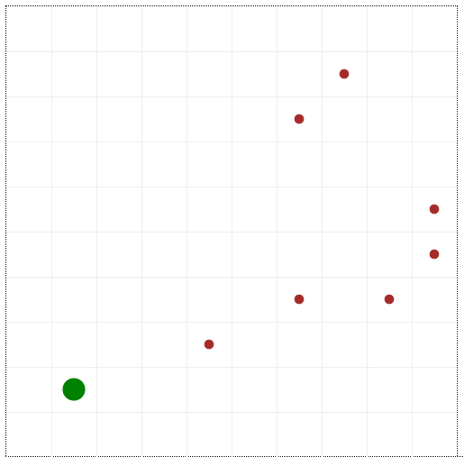

# Roomba
Using the code provided in the [TC2008B course repository](https://github.com/octavio-navarro/TC2008B/tree/main/mesaExamples/randomAgents), we created a simple roomba simulation that cleans up trash objects in the grid.

Mesa and Flask is required in order to run, install both using:

    pip install mesa && pip install flask
To run the simulation use:

    python3 server.py

## Simulation Behaviour
- User can select up to five roombas (one roomba as default), all roombas are initilized at position [1,1] and trash cells are initialized in random cells throughout the grid. 

- All five roombas will move in different directions throughout the grid and cleaning up trash in the way.
- The roombas will not pick the same position twice in order for it to not be repeating the same directions, however if it were to get stuck due to all possible directions being visited the roomba will simply choose a random position to move from all it's possible directions.
- If one of it's possible directions to move to happens to contain trash, the roomba will prioritize that direction and move towards it, cleaning it once it moves.
- User has the option to set a maximum number of steps, once that number of steps are reached the simulation ends.
- Two charts are displayed below the grid, the first chart shows the total number of steps each individual roomba has taken, and the second pie chart below shows the total clean cells and trash cells. As the roombas clean up the trash, the pie chart updates based on how many trash cells are remaining in the grid.

#### Collaborators
- Alfredo Jeong Hyun Park
- Diego Mellado Oliveros